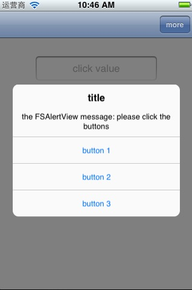

FSAlertView
===========

Customization UIView replace UIAlertView can include a lot of Buttons,the FSAlertView would be placed between Top Bar and Bottom Bar and automatically scroll well.


Features
========

* Works like UIAlertView.So does the Init,Delegate.
* Runs on iOS5,6,7,8.
* No using ARC.

What you need
---

* [FSAlertView.h](https://github.com/Ericfengshi/FSAlertView/blob/master/FSAlertView.h)
* [FSAlertView.m](https://github.com/Ericfengshi/FSAlertView/blob/master/FSAlertView.m)

How to use
---  

```objective-c
- (void)more{
    
    FSAlertView *moreAlert = [[FSAlertView alloc] initWithTitle:@"title"
                                                        message:@"the FSAlertView message: please click the buttons"
                                                       delegate:self
                                              cancelButtonTitle:@"cancel"
                                              otherButtonTitles:@"button 1",@"button 2",@"button 3"
                                                                ,@"button 4",@"button 5",@"button 6"
                                                                ,@"button 7",@"button 8",@"button 9",@"button 10", nil];
    
    [moreAlert showInView];
    [moreAlert release];
}

#pragma mark -
#pragma mark -FSAlertViewDelegate
- (void)fsAlertView:(UIView*)fsAlertView clickedButtonAtIndex:(NSInteger)buttonIndex {

}
```

##No Title
```objective-c

    FSAlertView *moreAlert = [[FSAlertView alloc] initWithTitle:nil
                                                        message:@"the FSAlertView message: please click the buttons"
                                                       delegate:self
                                              cancelButtonTitle:@"cancel"
                                              otherButtonTitles:@"button 1",@"button 2",@"button 3"
                                                                ,@"button 4",@"button 5",@"button 6"
                                                                ,@"button 7",@"button 8",@"button 9",@"button 10", nil];
    
```


##No Message
```objective-c

    FSAlertView *moreAlert = [[FSAlertView alloc] initWithTitle:@"title"
                                                        message:nil
                                                       delegate:self
                                              cancelButtonTitle:@"cancel"
                                              otherButtonTitles:@"button 1",@"button 2",@"button 3"
                                                                ,@"button 4",@"button 5",@"button 6"
                                                                ,@"button 7",@"button 8",@"button 9",@"button 10", nil];
    
```


##No Cancel
```objective-c

    FSAlertView *moreAlert = [[FSAlertView alloc] initWithTitle:@"title"
                                                        message:@"the FSAlertView message: please click the buttons"
                                                       delegate:self
                                              cancelButtonTitle:nil
                                              otherButtonTitles:@"button 1",@"button 2",@"button 3", nil];

```



##No Button
If cancelButtonTitle and otherButtonTitles both be nil,the FSAlertView would be disappear after 3 seconds.

```objective-c

    FSAlertView *moreAlert = [[FSAlertView alloc] initWithTitle:@"title"
                                                        message:@"the FSAlertView message: please click the buttons"
                                                       delegate:self
                                              cancelButtonTitle:nil
                                              otherButtonTitles:nil];

```


##Only Button
```objective-c
    
    FSAlertView *moreAlert = [[FSAlertView alloc] initWithTitle:nil
                                                        message:nil
                                                       delegate:self
                                              cancelButtonTitle:@"cancel"
                                              otherButtonTitles:@"button 1",@"button 2",@"button 3"
                                                                ,@"button 4",@"button 5",@"button 6"
                                                                ,@"button 7",@"button 8",@"button 9",@"button 10", nil];
    
```


##Has Two Button
```objective-c
    
    FSAlertView *moreAlert = [[FSAlertView alloc] initWithTitle:@"title"
                                                        message:@"the FSAlertView message: please click the buttons"
                                                       delegate:self
                                              cancelButtonTitle:@"cancel"
                                              otherButtonTitles:@"button 1", nil];
    // or
    FSAlertView *moreAlert = [[FSAlertView alloc] initWithTitle:@"title"
                                                        message:@"the FSAlertView message: please click the buttons"
                                                       delegate:self
                                              cancelButtonTitle:nil
                                              otherButtonTitles:@"button 1",@"button 2", nil];
    
```


